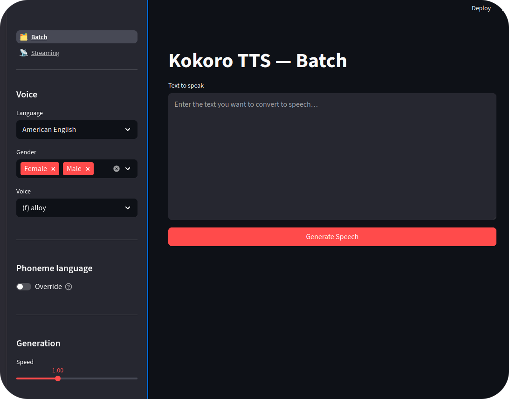

# Kokoro Speaker App

Kokoro is a lightweight multilingual text-to-speech model ([Kokoro-82M](https://huggingface.co/hexgrad/Kokoro-82M)).

This project provides a GUI to interact with the model. 
The model is runned thanks to an HTTP server that you can reuse for other apps.



    
There are two modes:

- batch
- streaming (just demonstrate how the API work. Streamlit does not play audio live).


---

## Project structure

```
kokoro_speaker/
├── app.py            # Streamlit UI
├── run_server.py     # FastAPI server entry point
├── requirements.txt
└── src/
    └── server.py     # Single POST /v1/audio/speech endpoint
```

---

## Installation (local install)

**System dependency** — Kokoro requires `espeak-ng` for phoneme conversion:

```bash
sudo apt install espeak-ng        # Debian / Ubuntu
brew install espeak-ng            # macOS
```

**Python dependencies:**

```bash
python3 -m venv venv
source venv/bin/activate
pip3 install -r requirements.txt
```

---

## Usage

Start the two processes in separate terminals:

```bash
# Terminal 1 — TTS server (default: http://localhost:8000)
python run_server.py

# Terminal 2 — Streamlit app (default: http://localhost:8501/kokoro)
streamlit run app.py
```

Optional server flags:

```bash
python run_server.py --host 0.0.0.0 --port 8000 --reload
```

---

## Docker

For some unknown reason, the build of the docker server takes forever (never returns).
Therefore, the current docker-compose is unusable... Sorry for that.

---

## API

The server exposes a single OpenAI-compatible endpoint:

```
POST /v1/audio/speech
```

**Request body (JSON):**

| Field | Type | Default | Description |
|---|---|---|---|
| `input` | string | — | Text to synthesize |
| `voice` | string | `af_heart` | Voice ID (see list below) |
| `speed` | float | `1.0` | Speed multiplier (0.5–2.0) |
| `language` | string | `null` | Phoneme language override (`a`, `b`, `e`, …). Auto-detected from voice prefix if omitted. |
| `response_format` | string | `wav` | Output format (currently `wav`) |

**Response:** raw WAV audio bytes (`audio/wav`).

**Example:**

```bash
curl -X POST http://localhost:8000/v1/audio/speech \
     -H "Content-Type: application/json" \
     -d '{"input": "Hello world", "voice": "af_heart", "speed": 1.0}' \
     --output speech.wav
```

---


## Output files

Generated audio is saved to the `outputs/` folder. If no filename is specified, files are named automatically:

```
outputs/001-american-english-af_heart.wav
outputs/002-french-ff_siwis.wav
```

The index is derived from the highest existing file index in `outputs/`, so files never overwrite each other.
